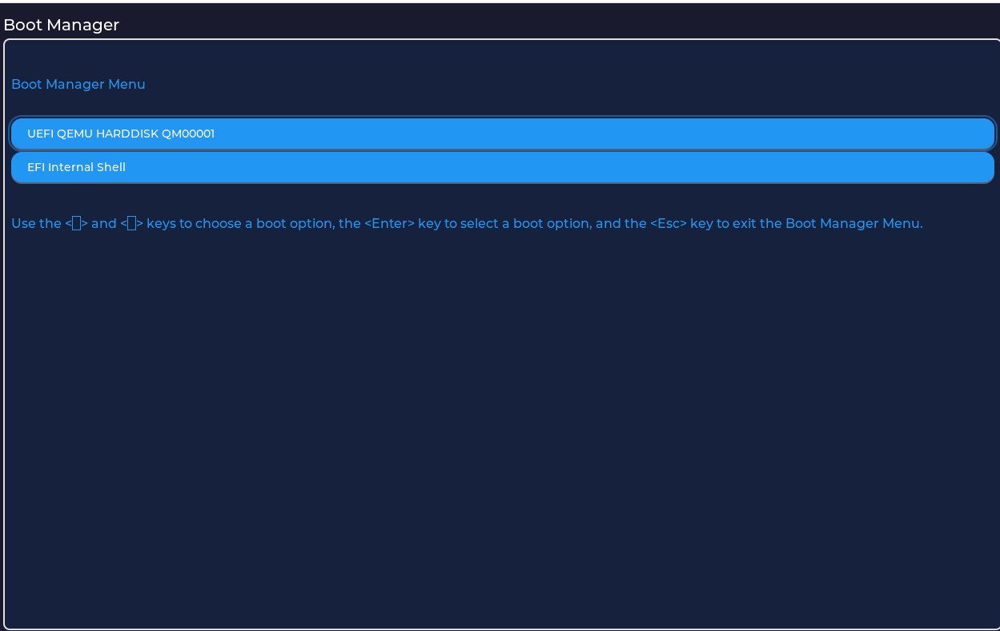
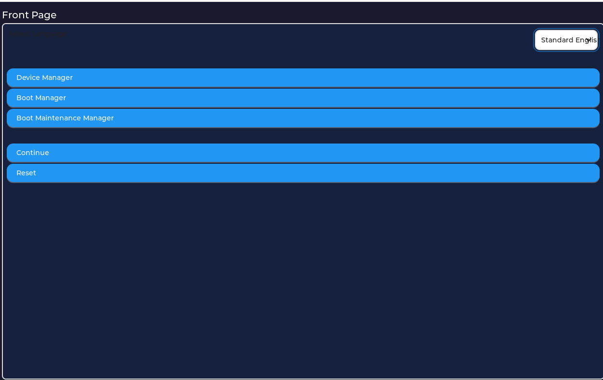

# [LVGL](https://github.com/lvgl/lvgl) on UEFI Environment

## Project Goal

Replace EDK2's native text-based HII Form Browser UI with an LVGL-based graphical renderer. The approach is **Display Engine Replacement** — we implement `EFI_DISPLAY_ENGINE_PROTOCOL` so that `SetupBrowserDxe` (the IFR parser, expression evaluator, and config router) continues working unchanged, while our code handles only the rendering layer via LVGL.

### Architecture

```
BDS (F2/DEL) → EFI_FORM_BROWSER2_PROTOCOL (SetupBrowserDxe)
                    │
                    │  walks IFR, evaluates expressions, manages config
                    │
                    ▼
              EFI_DISPLAY_ENGINE_PROTOCOL ← WE REPLACE THIS
              (LvglDisplayEngineDxe)
                    │
                    │  FORM_DISPLAY_ENGINE_FORM → LVGL widgets
                    │
                    ▼
                  LVGL → EFI_GRAPHICS_OUTPUT_PROTOCOL → pixels on screen
```

We do **not** reimplement IFR parsing. SetupBrowserDxe handles all of that. Our `FormDisplay()` receives a clean linked list of `FORM_DISPLAY_ENGINE_STATEMENT` structs — one per visible question — and maps each to an LVGL widget.

### IFR Opcode → LVGL Widget Mapping

| IFR Opcode         | LVGL Widget          |
|--------------------|----------------------|
| SUBTITLE           | `lv_label` (styled)  |
| TEXT               | `lv_label`           |
| CHECKBOX           | `lv_checkbox`        |
| NUMERIC            | `lv_spinbox`         |
| ONE_OF             | `lv_dropdown`        |
| STRING             | `lv_textarea`        |
| PASSWORD           | `lv_textarea` (password mode) |
| REF (goto)         | `lv_btn`             |
| ACTION             | `lv_btn`             |
| ORDERED_LIST       | vertical panel of rows with Up/Down buttons |

## Repository Structure

```
LvglPkg/
├── Library/LvglLib/           LVGL UEFI port (GOP display, mouse, keyboard)
│   ├── LvglLib.c              Init/deinit, tick, main loop
│   ├── lv_uefi_display.c      GOP flush callback
│   ├── lv_port_indev.c        Mouse (AbsolutePointer) + keyboard input
│   └── lvgl/                  Upstream LVGL source (submodule)
├── LvglDisplayEngineDxe/      Display engine DXE driver (the main deliverable)
│   ├── LvglDisplayEngineDxe.c Protocol installation, entry/unload
│   ├── LvglFormRenderer.c     FormDisplay() → LVGL widget builder + event loop
│   └── LvglFormRenderer.h     Renderer types and API
├── Application/               Demo UEFI shell applications
├── Include/                   Public headers (LvglLib.h)
└── LvglPkg.dsc / .dec / .fdf Package build files
```

## Build

#### X64-MSVC
```
build -p LvglPkg\LvglPkg.dsc -a X64 -t VS2022 -b RELEASE
```

#### X64-GCC
```
. edksetup.sh
build -p LvglPkg/LvglPkg.dsc -a X64 -t GCC -b RELEASE
```

#### AARCH64-GCC
```
export GCC_AARCH64_PREFIX=aarch64-none-linux-gnu-
. edksetup.sh
build -p LvglPkg/LvglPkg.dsc -a AARCH64 -t GCC -b RELEASE
```

#### Build OVMF with LvglDisplayEngineDxe
```bash
cd ~/workspace/edk2
source edksetup.sh
export PACKAGES_PATH=$HOME/workspace/edk2:$HOME/workspace/edk2/LvglPkg
build -a X64 -t GCC -b DEBUG -p OvmfPkg/OvmfPkgX64.dsc
```

#### Running in QEMU
```bash
qemu-system-x86_64 \
  -machine q35 \
  -m 512M \
  -smp 2 \
  -drive if=pflash,format=raw,unit=0,readonly=on,file=Build/OvmfX64/DEBUG_GCC/FV/OVMF_CODE.fd \
  -drive if=pflash,format=raw,unit=1,file=/tmp/OVMF_VARS.fd \
  -drive format=raw,file=fat:rw:/tmp/efi_files \
  -device qemu-xhci,id=xhci \
  -device usb-kbd,bus=xhci.0 \
  -device usb-mouse,bus=xhci.0 \
  -machine usb=on \
  -debugcon file:/tmp/debug.log -global isa-debugcon.iobase=0x402 \
  -display gtk \
  -serial stdio 2>&1
```
Press F2 or DEL at the OVMF splash screen to enter Setup — the LVGL-based form browser renders the HII forms graphically.

## LvglLib Usage

1. Include LvglLib like other UEFI Library Class in your UEFI_APPLICATION
2. In App ENTRY_POINT:
   - ~~Call `UefiLvglInit()` to do init~~
   - Call `UefiLvglAppRegister (MyApp)` to show `MyApp`
   - ~~Call `UefiLvglDeinit()` to do deinit, and you may need another code to do clear up for `MyApp`~~

## Demo

  
  

### Demo Usage

1. Download [OVMF.fd](./Demo/Bin/OVMF.fd)
2. Create EfiFiles folder and copy `UefiDashboard.efi` binary to it
3. qemu-system-x86_64 -bios OVMF.fd -hda fat:rw:EfiFiles -net none -device qemu-xhci,id=xhci -device usb-kbd,bus=xhci.0 -device usb-mouse,bus=xhci.0 -serial stdio
4. Boot to UEFI Shell
5. `fs0:` then [Enter], `UefiDashboard.efi` then [Enter]
6. Press `Esc` to exit `UefiDashboard`

## Current Status

`FormDisplay()` is working end-to-end: LVGL renders HII forms graphically with widget mapping for all major IFR opcodes. Keyboard navigation (UP/DOWN focus, ENTER to edit, ESC to exit), mouse input, and string field value commits are all functional. Active development is focused on F-key hotkeys and the visual theme.

## TODO
- [x] Absolute Pointer Mouse
- [x] Simple Pointer Mouse
- [x] Mouse Wheel
- [x] Log/Debug Print
- [x] LvglDisplayEngineDxe — EFI_DISPLAY_ENGINE_PROTOCOL skeleton
- [x] FormDisplay() — IFR opcode → LVGL widget builder
- [x] Fix mouse in display engine (cursor lost on screen switch)
- [x] Keyboard navigation (UP/DOWN focus, ESC exits form, ENTER toggles editing on spinbox/dropdown/textarea)
- [x] `EFI_IFR_ORDERED_LIST_OP` renderer (Boot Order / Driver Order) — Up/Down buttons per entry, reorder committed via `USER_INPUT.InputValue.Buffer`
- [x] String field value commit — `OnStringReady` allocates pool buffer (`AllocateZeroPool(CurrentValue.BufferLen)`) and calls `HiiSetString`; satisfies SetupBrowserDxe's `FreePool(InputValue.Buffer)` and `CopyMem(BufferValue, Buffer, BufferLen)` contract
- [ ] Function-key hotkeys (F9 Load Defaults, F10 Save, driver-registered hotkeys from `HotKeyListHead`)
- [ ] Theme/styling pass (fonts, colors, readability)
- [ ] File System
- [ ] ~~VS2022~~/~~AARCH64-GCC~~/Clang
- [ ] Code Clean(Remove Unused Source File in .inf)
- [ ] ...

## Origin

Forked from [YangGangUEFI/LvglPkg](https://github.com/YangGangUEFI/LvglPkg), which provides the LVGL-to-UEFI port (GOP display driver, input handling). The display engine replacement and HII integration is original work.

## Note
1. For Edk2 EmulatorPkg user, use the RELEASE build or build LvglPkg/Application/LvglDemoApp.inf in EmulatorPkg.dsc

## License

BSD-2-Clause-Patent (same as EDK2).
